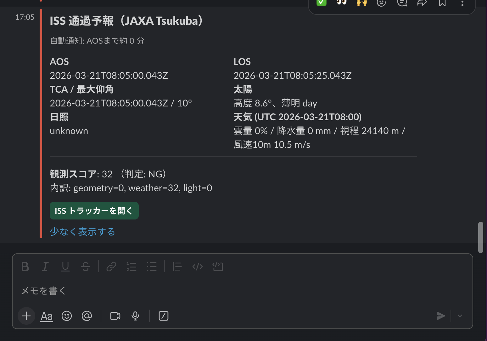

# ISS Notifier / ISS 通過通知エンジン


> **EN**: An engine that predicts visible ISS passes and sends notifications based on weather and illumination conditions.
> **JP**: ISS（国際宇宙ステーション）の可視パスを予測し、天候・日照条件を加味して通知するエンジンです。

---

## 💡 Motivation / 動機

- **EN**:
  I wanted a practical system to decide whether an ISS pass is *actually worth observing*, not just geometrically visible.
  By combining orbital mechanics, weather data, and illumination, this project aims to automate that decision end-to-end.

- **JP**:
  ISS の通過が理論上見えるだけでなく、
  本当に観測する価値があるかを自動で判断したい、という動機から作りました。
  軌道計算・天気・日照条件を統合し、通知まで含めて一気通貫で扱うことを目的としています。

---

## ✨ Overview / 概要

- **EN**: This service periodically predicts ISS passes over predefined ground stations, evaluates visibility using geometry + weather + illumination, and notifies via Slack with rich details.
- **JP**: あらかじめ登録した地上局上空の **ISS 通過（パス）** を定期予測し、**幾何・天気・日照**の 3 要素から可視性をスコア化して、**Slack** に詳細通知します。

---

## 🔔 Notification Example / 通知例



- **EN**: Example of a Slack notification including pass timing, elevation, weather, and illumination score.
- **JP**: パス時刻、最大仰角、天気、日照スコアを含む Slack 通知の例です。

---

## 🔧 Features / 主な機能

- **Pass prediction** (SGP4 via `satellite.js`) / **パス予測**（`satellite.js` による SGP4）
- **Illumination check** with Sun vector & cylindrical shadow approximation / **日照判定**（太陽ベクトル＋円柱影近似）
- **Weather integration** (Open‑Meteo hourly) / **天気連携**（Open‑Meteo 時間データ）
- **Scoring** (0–100: geometry 40, weather 40, light 20) / **スコアリング**（0–100：幾何40・天気40・光20）
- **Slack notification** (Block Kit payload) / **Slack 通知**（Block Kit）
- **Cron scheduler** (1‑min tick) & duplicate suppression / **スケジューラ**（1分周期）＋重複通知防止
- **Resilience**: timeout + retry + structured logging / **堅牢化**：タイムアウト・リトライ・構造化ログ
- **Comprehensive tests** with mocks (Jest + ts‑jest) / **包括的なテスト**（Jest + ts‑jest、外部依存をモック）

---

## 🏗 Architecture (Brief) / アーキテクチャ（概要）

```
cron(schedule) → ensureTleFresh → getCurrentTle
                  ↓
            findPasses(tle, station, window)
                  ↓
  getWeatherAt     getSunState     getIllumination
          \           |                 /
           \          |                /
                 scoreObservation
                        ↓
          buildPassNotificationPayload → postSlack
                        ↓
                 notified_pass (SQLite)
```

- **EN**: Modules are split into `core/` (domain logic), `jobs/` (scheduler), `notify/` (Slack), `routes/` (Fastify), and `db/`.
- **JP**: `core/`（ドメインロジック）、`jobs/`（スケジューラ）、`notify/`（Slack）、`routes/`（Fastify）、`db/`（SQLite）にモジュール分割しています。

---

## 📦 Tech Stack / 技術スタック

- Node.js, TypeScript, Fastify
- satellite.js, SunCalc, Open‑Meteo API
- SQLite (better‑sqlite3)
- Slack Webhook (Block Kit)
- Jest + ts‑jest

---

## 🚀 Quick Start / クイックスタート

```bash
# 1) Install dependencies / 依存関係のインストール
npm ci

# 2) Type check / 型チェック
npm run typecheck

# 3) Run tests / テスト実行
npm test

# 4) Dev server (Fastify + scheduler) / 開発サーバ起動（スケジューラ含む）
npm run dev

# 5) Build & start / ビルド & 実行
npm run build
npm start
```

> **Note / 補足**: Slack Webhook を使う場合は `.env` に URL を設定してください（下記参照）。

---

## ⚙️ Configuration / 設定（.env）

Create `.env` at project root: / プロジェクト直下に `.env` を作成:

```env
# Server
PORT=3000

# Database (SQLite file path)
SQLITE_PATH=./data/app.db

# Slack Webhook (optional for notifications)
SLACK_WEBHOOK_URL=

# Node environment
NODE_ENV=development
```

- **EN**: `.env` is **git‑ignored**. Never commit secrets.
- **JP**: `.env` は **.gitignore 済み**。機密は絶対にコミットしないでください。

---

## 🧪 Testing / テスト

```bash
# Run all tests / すべてのテスト
npm test

# Watch mode / 監視モード
npm run test:watch

# Coverage report / カバレッジ
npm run test:cov
```

- **EN**: External APIs and Slack are mocked; tests run offline and deterministically.
- **JP**: 外部 API と Slack はモック済みのため、オフラインかつ決定的にテストが走ります。

---

## 🛠 Common Scripts / よく使うスクリプト

```jsonc
// package.json (excerpt)
{
  "scripts": {
    "dev": "nodemon --watch src --exec ts-node src/index.ts",
    "build": "tsc",
    "start": "node dist/index.js",
    "typecheck": "tsc -p tsconfig.json --noEmit",
    "test": "jest --passWithNoTests",
    "test:watch": "jest --watch",
    "test:cov": "jest --coverage"
  }
}
```

---

## 🧭 Directory Layout / ディレクトリ構成

```
src/
  core/           # pass prediction, weather, sun, illumination, scoring
  jobs/           # cron scheduler (start/stop)
  notify/         # Slack payload & webhook
  routes/         # Fastify routes (health, passes)
  db/             # SQLite accessors
  index.ts        # app bootstrap

test/
  mocks/          # moduleNameMapper-based local mocks (e.g., satellite.js)

.github/workflows/ci.yml  # GitHub Actions (CI)
```

- **EN**: The scheduler exposes `startScheduler()` and `stopScheduler()` so tests can stop timers cleanly.
- **JP**: スケジューラは `startScheduler()` / `stopScheduler()` を公開し、テストで確実にタイマーを停止できます。

---

## 🔒 Resilience Notes / 信頼性メモ

- **EN**: `fetchWithTimeout` + retry (exponential backoff & jitter), structured logs (`src/lib/log.ts`).
- **JP**: `fetchWithTimeout` と指数バックオフ（ジッタ付）のリトライ、構造化ログで障害解析性を向上させています。

---

## 🧰 Operations / 運用

- **Scheduler cadence**: 1 min / **スケジューラ周期**：1分
- **Dedup**: DB table `notified_pass` prevents duplicate notifications.
  **重複防止**：`notified_pass` テーブルで同一パスの再通知を抑止
- **Observability**: `notification_log` and JSON logs / **可観測性**：`notification_log` と JSON ログ

---

## ✅ CI (GitHub Actions)

- **EN**: A minimal CI workflow runs on push/PR: `npm ci` → `npm run typecheck` → `npm test`.
- **JP**: 最小 CI は push/PR で自動実行し、`npm ci` → `typecheck` → `test` を回します。

File: `.github/workflows/ci.yml`

```yaml
name: CI
on:
  push:
    branches: [ main ]
  pull_request:
jobs:
  test:
    runs-on: ubuntu-latest
    steps:
      - uses: actions/checkout@v4
      - uses: actions/setup-node@v4
        with:
          node-version: '20'
          cache: 'npm'
      - run: npm ci
      - run: npm run typecheck
      - run: npm test
```

> **EN**: Enable “Require status checks to pass” in branch protection to block merges when CI is red.
> **JP**: ブランチ保護で「ステータスチェック必須」を有効化し、CI が赤い PR のマージを防止します。

---

## 📌 Roadmap / 今後の拡張

- **EN**: Add Zod schemas for strict I/O validation; configurable scoring weights; multi‑channel notifications (email/SMS/Teams).
- **JP**: Zod による I/O 検証の厳格化、スコア重みの設定化、通知チャネルの多様化（メール/SMS/Teams など）。

---

## 📝 License / ライセンス

- **EN**: No license specified yet. Consider MIT for open‑source use.
- **JP**: まだライセンス未指定です。OSS 公開する場合は MIT などの採用をご検討ください。

---

## 🙌 Acknowledgments / 謝辞

- `satellite.js` for SGP4 and utilities
- `SunCalc` for solar position
- `Open‑Meteo` for weather data
- Slack (Block Kit) for notifications
<!-- CI bootstrap -->